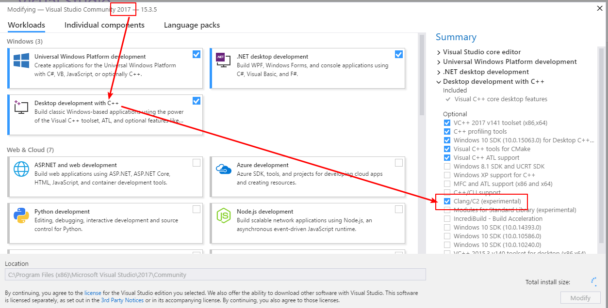
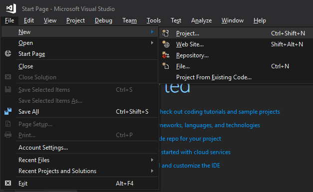
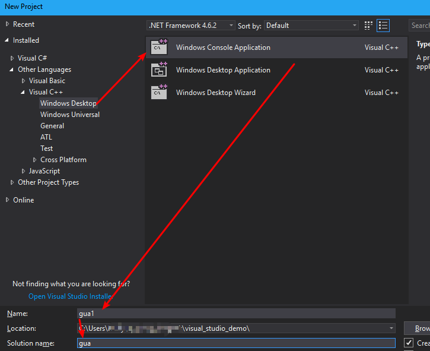
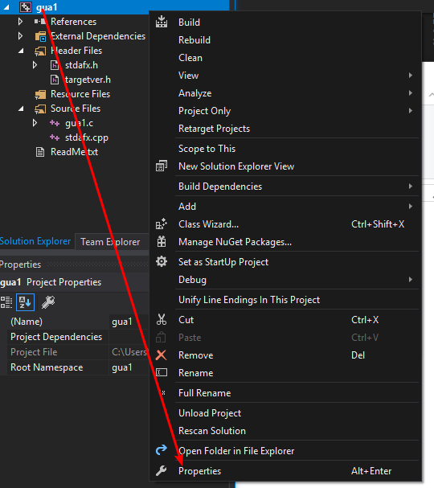
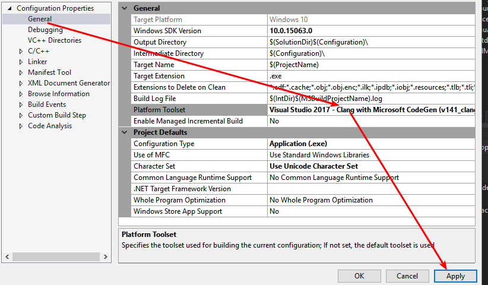
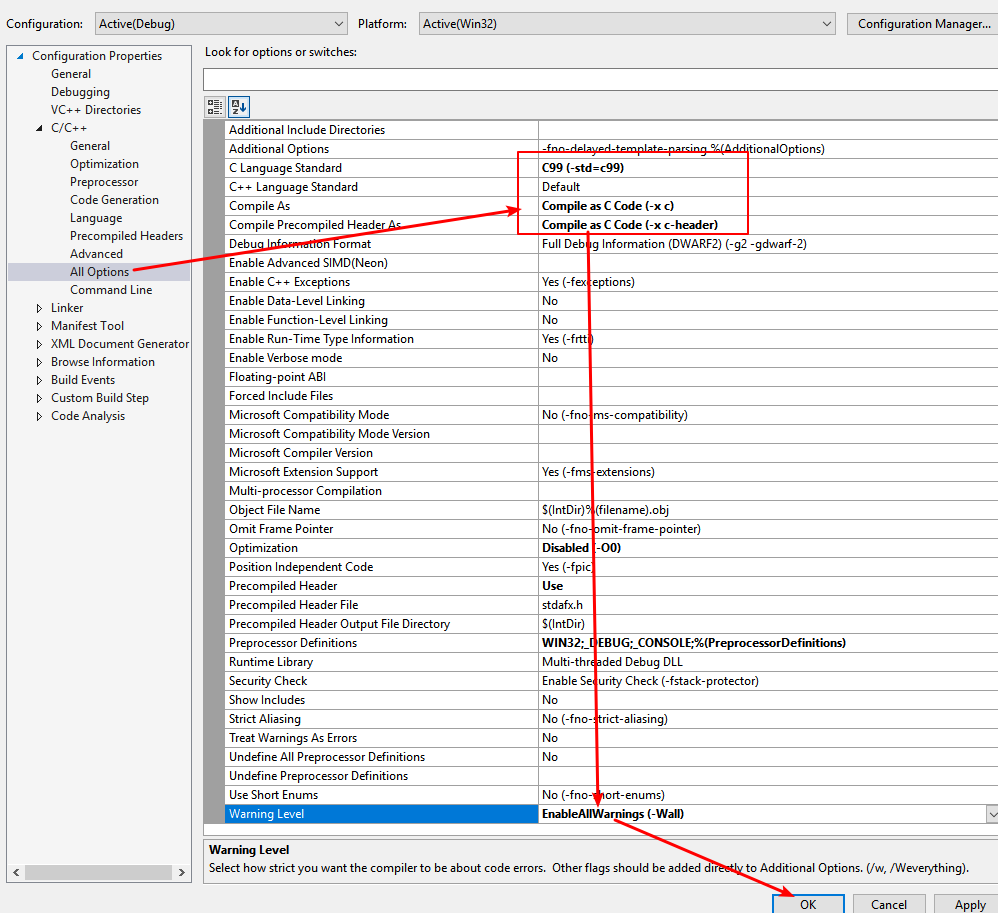
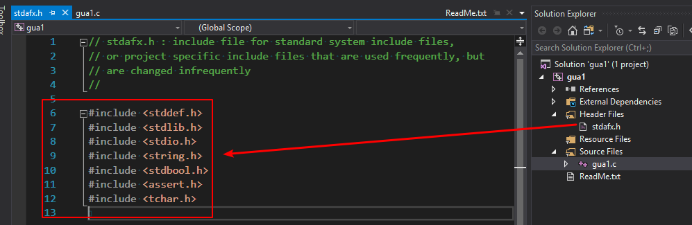
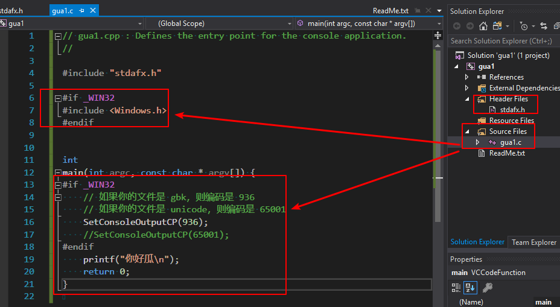
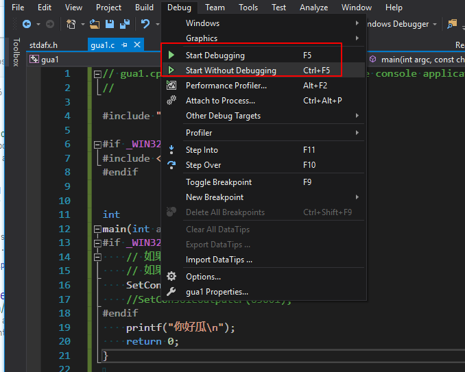
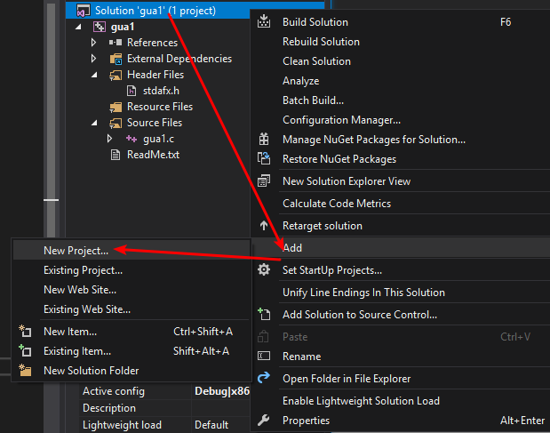

# visual studio 带中文支持的 c 语言编程完全指南

## 首先确保你安装了 `clang` 模块

## 新建 project，会自动新建 solution

## 打开 `clang` 设置

## 复制代码

1. 从项目里面复制正确的代码
2. 删除多余的文件
3. 改 `.cpp` 后缀为 `.c`

## 运行

1. 代码出问题了就加调试器
2. 代码没出问题不加，这样会有个 press any key to continue

# 一次作业一个 project

